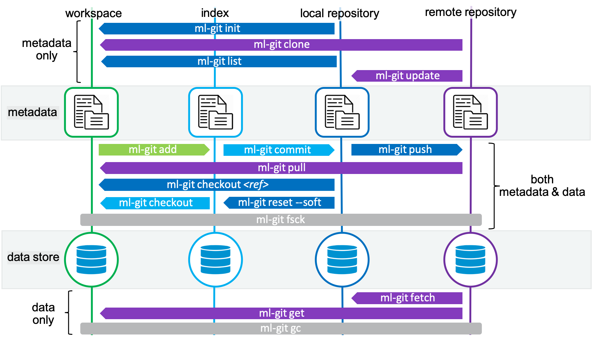

# ml-git : a Distributed Version Control System for  #

ml-git documentation:
* [Your first ML artefacts under ml-git management](docs/first_project.md)
* [Quick start](docs/quick_start.md)
* [ml-git commands documentation](docs/mlgit_commands.md)
* [Architecture & Internals of ml-git](docs/mlgit_internals.md)
* [S3 bucket configuration](docs/s3_configurations.md)
* [Info for ml-git Developers/Maintainers](docs/developer_info.md)
* [ml-git API](docs/mlgit_api.md)

## Context ##

One of the major  engineer challenge is to create projects enabling efficient collaboration from anyone within a team, across teams or across organizations.
A few questions to ask :
* How do you distribute your datasets & labels? How do you evolve these datasets?
* How do you list the available ML datasets & labels?
* How do you version a ML model?
* How do you exactly reproduce a specific ML model version?

Compared to legacy SW development, the challenge comes from 2 main reasons:
1. VCS are usually not made to keep versioning of a high number (~Millions) of - sometimes large - binary files
2. it's not a simple code/text -> binary relationship. There is a more complex relationship between a set of, let's call them, ML entities, as shown in Figure 1. Even though Figure 1. is not complete, it already shows a pretty good picture of  entities relationships.

|  |
|:--:|
| *Figure 1. ML entities* |

If one does not track exactly the version of a dataset, nobody will be able to reproduce a specific version of a ML model ... unless, the dataset is kept static/immutable. Unlikely to be a desirable property of a dataset in a  world.
If one cannot relate a label set to a specific dataset version, you end with the same constraints.

Today, it is so cumbersome to do these kind of dataset updates that most of public datasets are almost static. With the most active being updated once a year. Furthermore, since there is no version tracking system behind, there is no way for anyone to send, say, a pull request with new data. This is not a situation the worldwide  community wants to stay in.

## ml-git purpose ##

ml-git is a tool which aim is to provide a Distributed Version Control system to enable efficient  engineers collaboration. Like its name emphasizes, it is meant to be similar to git in mindset, concept and workflows.
More specifically, it should enable  engineers to
* manage a repository of different datasets, labels and models,
* version  engineers ML artefacts (dataset, labels, ...),
* distribute these ML artefacts between members of a team or across organizations,
* apply the right data governance and security models to their artefacts.

If done right, we should not only enable  engineers track versioning of ML entities (dataset, labels, ...), but also reproduce any experiment **and** enable easy updates of any (public) datasets.

<a href="https://asciinema.org/a/aiJmsKLjt5Jjgfn42au186Pm6?theme=solarized-dark"></a>

In a nutshell, ml-git operates at the level of a project and within a project on specific ML entities (dataset, labels, ...).
For each of these ML entities, the workflow of meta-/data transport commands follows to the ones described in Figure 2.

|  |
|:--:|
| *Figure 2. ml-git meta-/data transport commands* |

## ml-git setup & usage ##


### prerequisites ###
- [Git](https://git-scm.com/book/en/v2/Getting-Started-Installing-Git)

### quick setup ###

Download ml-git repository:
```
$ git clone 
```

Install ml-git
```
$ cd ml-git/
$ python setup.py install
```

As ml-git leverages git to manage ML entities metadata, it is necessary to configure user name and email address:
```
$ git config --global user.name "Sébastien Tandel"
$ git config --global user.email "sebastien.tandel@hp.com"
```

ml-git usage
```
$ ml-git --help
ml-git: a distributed version control system for ML
	Usage:
	ml-git init [--verbose]
	ml-git store (add|del) <bucket-name> [--credentials=<profile>] [--type=<store-type>] [--verbose]
	ml-git (dataset|labels|model) remote (add|del) <ml-git-remote-url> [--verbose]
	ml-git (dataset|labels|model) (init|list|update|fsck|gc) [--verbose]
	ml-git (dataset|labels|model) (branch|remote-fsck|show|status) <ml-entity-name> [--verbose]
	ml-git (dataset|labels|model) push <ml-entity-name> [--retry=<retries>] [--clearonfail] [--verbose]
	ml-git dataset checkout <ml-entity-tag> [(--group-sample=<amount:group-size> --seed=<value> | --range-sample=<start:stop:step> | --random-sample=<amount:frequency> --seed=<value>)] [--force] [--retry=<retries>] [--verbose]
	ml-git model checkout <ml-entity-tag> [(--group-sample=<amount:group-size> --seed=<value> | --range-sample=<start:stop:step> | --random-sample=<amount:frequency> --seed=<value>)] [-d] [-l]  [--force] [--retry=<retries>] [--verbose]
	ml-git labels checkout <ml-entity-tag> [(--group-sample=<amount:group-size> --seed=<value> | --range-sample=<start:stop:step> | --random-sample=<amount:frequency> --seed=<value>)] [-d]  [--force] [--retry=<retries>] [--verbose]
	ml-git (dataset|labels|model) fetch <ml-entity-tag> [(--group-sample=<amount:group-size> --seed=<value> | --range-sample=<start:stop:step> | --random-sample=<amount:frequency> --seed=<value>)] [--retry=<retries>] [--verbose]
	ml-git (dataset|labels|model) add <ml-entity-name> [--fsck] [--bumpversion] [--verbose]
	ml-git dataset commit <ml-entity-name> [--tag=<tag>] [-m MESSAGE|--message=<msg>] [--fsck] [--verbose]
	ml-git labels commit <ml-entity-name> [--dataset=<dataset-name>] [--tag=<tag>] [-m MESSAGE|--message=<msg>] [--verbose]
	ml-git model commit <ml-entity-name> [--dataset=<dataset-name] [--labels=<labels-name>] [-m MESSAGE|--message=<msg>] [--tag=<tag>] [--verbose]
	ml-git (dataset|labels|model) tag <ml-entity-name> list  [--verbose]
	ml-git (dataset|labels|model) tag <ml-entity-name> (add|del) <tag> [--verbose]
	ml-git (dataset|labels|model) reset <ml-entity-name> (--hard|--mixed|--soft) (HEAD|HEAD~1) [--verbose]
	ml-git config list
	ml-git (dataset|labels|model) create <artefact-name> --category=<category-name>... --version-number=<version-number> --import=<folder-name> [--wizzard-config] [--verbose]
	ml-git (dataset|labels|model) import [--credentials=<profile>] [--region=<region-name>] [--retry=<retries>] [--path=<pathname>|--object=<object-name>] <bucket-name> <entity-dir> [--verbose]
	ml-git clone <repository-url>

	Options:
	--credentials=<profile>            Profile of AWS credentials [default: default].
	--fsck                             Run fsck after command execution.
	--force                            Force checkout command to delete untracked/uncommitted files from local repository.
	--region=<region>                  AWS region name [default: us-east-1].
	--type=<store-type>                Data store type [default: s3h].
	--tag                              A ml-git tag to identify a specific version of a ML entity.
	--verbose                          Verbose mode.
	--bumpversion                      (dataset add only) increment the dataset version number when adding more files.
	--retry=<retries>                  Number of retries to upload or download the files from the storage [default: 2].
	--clearonfail                      Remove the files from the store in case of failure during the push operation.
	--group-sample=<amount:group-size> The group sample option consists of amount and group used to download a sample.
	--seed=<value>                     The seed is used to initialize the pseudorandom numbers.
	--range-sample=<start:stop:step>   The range sample option consists of start, stop and step used to download a
	                                   sample. The start parameter can be equal or greater than zero. The stop parameter
	                                   can be all, -1 or any integer above zero.
	--random-sample=<amount:frequency> The random sample option consists of amount and frequency and used to download a sample.
	-d                                 If exist a dataset related with the model or labels, this one must be downloaded.
	-l                                 If exist a labels related with the model, this one must be downloaded.
	-h --help                          Show this screen.
	--version                          Show version.
	-m MESSAGE --message               Use the given <msg> as the commit message.
	--hard                             Revert the committed files and the staged files to 'Untracked Files' Also remove these files from workspace.
	--mixed                            Revert the committed files and the staged files to 'Untracked Files'. This is the default action.
	--soft                             Revert the committed files to "Changes to be committed".
	--HEAD                             Will keep the metadata in the current commit.
	--HEAD~1                           Will move the metadata to the last commit.
	--wizzard-config                   If specified, ask interactive questions at console for git & store configurations.
	--path                             Bucket folder path
	--object                           Filename in bucket
```

