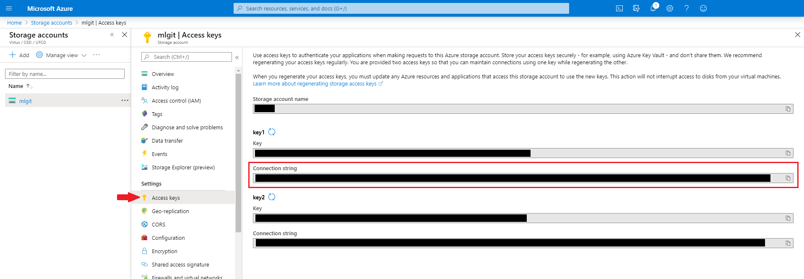

# Azure container configuration #


Ml-git allows the user to choose to have their data stored in an Azure Blob Storage that provides massively scalable storage for unstructured data like images, videos, or documents.


This section explains how to configure the settings that ml-git uses to interact with your Azure container. 

To establish the connection between ml-git and Azure services you will need a connection string which can be found on the Azure portal. See the image below:



With this connection string in hand, you can configure your environment in two ways (this order is the one used by ml-git to get your credentials):

+ [Environment Variable](#config-environment-variable)
+ [Azure CLI](#azure-cli)

#### <a name="config-environment-variable"> 1. Environment Variable </a> ####

You can add the connection string to your system's set of variables. Ml-git will look for the variable **AZURE_STORAGE_CONNECTION_STRING**.

To add the system variable, run the following command:

**Windows**:

```setx AZURE_STORAGE_CONNECTION_STRING "<yourconnectionstring>"```

**Linux or macOS**:

```export AZURE_STORAGE_CONNECTION_STRING="<yourconnectionstring>"```

#### <a name="azure-cli"> 2. Azure CLI </a> ####

The Azure command-line interface (Azure CLI) is a set of commands used to create and manage Azure resources. The Azure CLI is available across Azure services and is designed to get you working quickly with Azure, with an emphasis on automation.

Azure CLI uses a file to store the configurations that are used by its services. To add settings to the file, simply run the following command:

```
$ az configure
```

If tou prefer, you can create a configuration file through the console. The configuration file itself is located at ```$AZURE_CONFIG_DIR/config```. The default value of ```AZURE_CONFIG_DIR``` is ```$HOME/.azure``` on Linux and macOS, and ```%USERPROFILE%\.azure``` on Windows.
    
   From the home directory (UserProfile) execute:   
            
   ```
   $ mkdir .azure
   ```
   
   You need to create the config file with the connection string value:
     
   ```
   $ echo "
    [storage]
    connection_string = "<yourconnectionstring>"
   " > .azure/config
   ```
