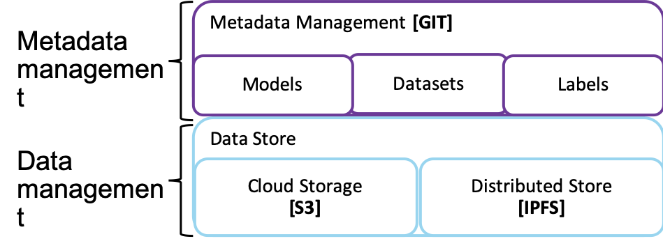
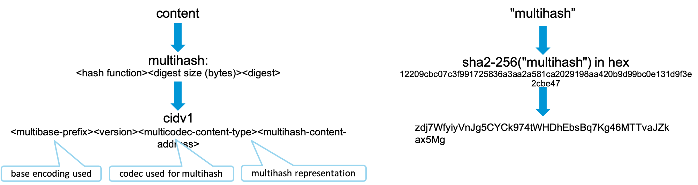
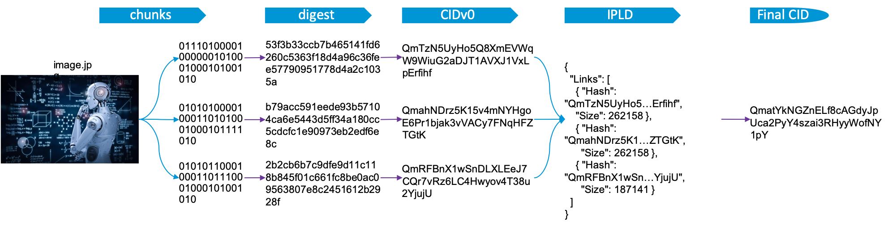
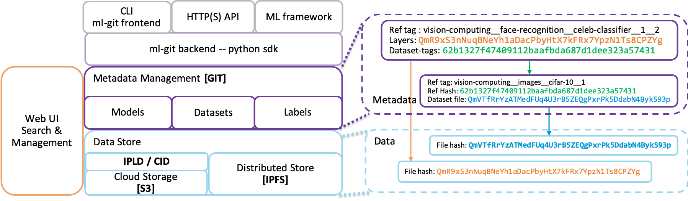
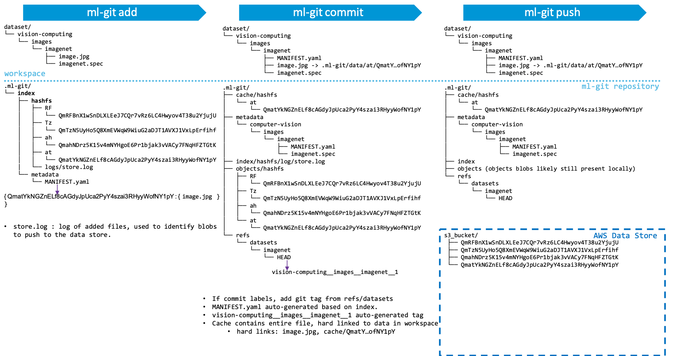

# ml-git: architecture and internals #

## metadata & data decoupling ##

The first design concept about ml-git is to decouple the ML entities metadata management from the actual data such that there are 2 main layers in the tool:
1. the metadata management : There are for each ML entities managed under ml-git, the user needs to define a small specification file. These files are then managed by a git repository to retrieve the different versions.

2. the data store management

|  |
|:--:|
| *Figure 1. Decoupling Metadata & Data Management Layers* |


### Content Addressable Storage for ml-git ##

ml-git has been implemented as a Content Addressable Storage, meaning that we can retrieve the information based on the content and not based on the location of the information.

|  |
|:--:|
| *Figure 2. self-describing content-addressed ID* |

Figure 2. shows the basic principle of multihash to obtain a CID which are used under the hood by ml-git to implement its content addressable storage layer.

In a nuthsell, CID, self-describing content-addressed ID enables natural evolution and customization over simple and fixed cryptographic hashing schemes.
As an argument why multihash is a useful feature, is that any cryptographic function ultimately ends being weak. As en example, when collisions have been proven with SHA-1, it's been a challenge for many softwares to use another cryptographic hash (including git).

Summarizing, a CID is :
* a unique identifier/hash of “multihash” content.
* encoding the digest of the original content enabling anyone to retrieve thatcontent wherever it lies (through some routing)
* enabling the integrity check of the retrieved content (thx to multihash and the encoded digest)

|  |
|:--:|
| *Figure 3. IPLD - CID for a file* |

There are a few steps to chunk a file to get an IPLD - CID format:
1. slide the file in piece of, say, 256KB
2. for each slice, compute its digest (currently, ml-git uses sha2-256)
3. obtain the CID for all these digests. These slice of files will be saved in a data store with the computed CID as their filename. 
4. build a json describing all the chunks of the file
5. obtain the CID of that json. That json will also be saved in the data store with the computed CID as its filename.

Note that this last CID is really the only piece of information you need to keep to retrieve the whole image.jpg file.
And last but not least, one can ensure the integrity of the file while downloading by computing the digests of all downloaded chunks and checking against the digest encoded in their CID.

Follow the links below for more information on
* [multihash](https://github.com/multiformats/multihash) 
* [CID](https://github.com/multiformats/cid)
* [IPLD](https://github.com/ipfs/js-ipfs/tree/master/examples/traverse-ipld-graphs)

### Why slicing files in chunks? ###

IPFS uses small chunk size of 256KB … Why?

* __security__ - easy to DOS nodes without forcing small chunks
* __deduplication__ - small chunks can dedup. big ones effectively dont.
* __latency__ - can externalize small pieces already (think a stream)
* __bandwidth__ - optimize the use of bandwidth across many peers
* __performance__ - better perf to hold small pieces in memory. hash along the dag to verify integrity of the whole thing.

the big DOS problem with huge leaves is that malicious nodes can serve bogus stuff for a long time before a node can detect the problem (imagine having to download 4GB before you can check whether any of it is valid). this was super harmful for bittorrent (when people started choosing huge piece sizes), attackers would routinely do this, very cheaply-- just serve bogus random data. smaller chunks are very important here.


## ml-git high-level architecture and metadata ##

|  |
|:--:|
| *Figure 4. ml-git high-level architecture and meta-/data relationships* |

So IPLD/CID has been implemented on top of the S3 driver.
The chunking strategy is a recommendation to turn S3 interactions more efficient when dealing with large files.
It's also interesting to note that if ml-git implements a Thread pool to concurrently upload & download files to a S3 bucket.
Last but not least, it would be possible to further accelerate ml-git interactions with a S3 bucket thanks to AWS CloudFront. (not implemented yet)

### ml-git baseline performance numbers ###

#### CamSeq01 under ml-git  ####

* CamSeq01 size : 92MB
* Locations: website in Cambridge -- S3 bucket in us-east-1 -- me in South Brazil

* Download from website: ~4min22s

* upload to S3 with ml-git :
    * Sequential : 13m24s
    * Concurrent (10 threads) : 6m49s
    * Concurrent (20 threads) : 4m29s
* download to S3 with ml-git :
    * Sequential : 7m21s
    * Concurrent (10 threads) : 1m11s
    * Concurrent (20 threads) : 0m51s

#### MSCoco (all files) under ml-git  ####

* MSCoco :
    * Size : 26GB
    * number of files : 164065 ; chunked into ~400-500K blobs (todo: exact blob count)
* Locations: original dataset: unknown -- S3 bucket in us-east-1 -- me in South Brazil

* Download from website: unknown

* upload to S3 with ml-git :
    * Concurrent (10 threads) : 12h30m
* download to S3 with ml-git :
    * Concurrent (10 threads) : 10h45m

#### MSCoco (zip files) under ml-git  ####

* MSCoco :
    * Size : 25GB
    * number of files : 3 (train.zip, test.zip, val.zip) ; 102299 blobs
* Locations: original dataset: unknown -- S3 bucket in us-east-1 -- me in South Brazil

* Download from website: unknown

* upload to S3 with ml-git :
    * Concurrent (10 threads) : 4h35m
* download to S3 with ml-git :
    * Concurrent (10 threads) : 3h39m

A couple of comments:
1) even though Python GIL is a challenge for true concurrency in the python interpreter, it still is very helpful and provides a significant improvement for ml-git performance,
2) not surprisingly, the number of files will affect the overall performance as it means there will be many more connections to AWS.
However, ml-git should implement rather soon an option to download some dataset partially (sampling) to enable CI/CD workflows for which some ML engineers may run some experiments locally on their own machine.
For that reason, it is intereseting to avoid downloading the full dataset if it's very large. That option would not be supported if the dataset is uploaded as a few zip files.

## ml-git add, commit, push commands internals ##

|  |
|:--:|
| *Figure 5. ml-git commands internals* |


# <a>Description ml-git commands internals</a>


### <a>Commands</a>:

- [ml-git init](#mlgit_init)
- [ml-git config](#mlgit_config)
- [ml-git <ml-entity> remote (add|del)](#mlgit_remote)
- [ml-git store](#mlgit_store)
- [ml-git <ml-entyt> init](#mlgit_entity_init)
- [ml-git <ml-entity> add](#mlgit_add)
- [ml-git <ml-entity> branch](#mlgit_branch)
- [ml-git <ml-entity> checkout](#mlgit_checkout)
- [ml-git <ml-entity> commit](#mlgit_commit)
- [ml-git <ml-entity> fetch](#mlgit_fetch)
- [ml-git <ml-entity> fsck](#mlgit_fsck)
- [ml-git <ml-entity> gc](#mlgit_gc)
- [ml-git <ml-entity> get](#mlgit_get)
- [ml-git <ml-entity> init](#mlgit_ml_init)
- [ml-git <ml-entity> list](#mlgit_list)
- [ml-git <ml-entity> push](#mlgit_push)
- [ml-git <ml-entity> reset](#mlgit_reset)
- [ml-git <ml-entity> show](#mlgit_show)
- [ml-git <ml-entity> status](#mlgit_status)
- [ml-git <ml-entity> tag](#mlgit_tag)
- [ml-git <ml-entity> update](#mlgit_update)


## <a>ml-git --help</a>

###### Description:

ml-git --help is a [**docstring**](https://www.python.org/dev/peps/pep-0257/) message, its used by **[docopt](https://github.com/docopt/docopt)** lib for create a parser to cli commands. 

## <a name="mlgit_version">ml-git --version</a>

###### Description:

Show version passed as parameter in docopt function.

## <a name="mlgit_init">ml-git init</a>

###### Description:

ml-git init verify if the current directory has **.ml-git**, where configuration files goes, and if doesn't have it, ml-git will create the directory and save **config.yaml** inside, with the informations provided by a *dict* in project code. 

###### Directory structure:

```
ml-git-project/
└── .ml-git/
    ├─── config.yaml
```


###### config.yaml structure:

```
dataset:
  git: ssh://git@github.com/standel/ml-datasets <-- git project url
store:
  s3: <-- store type (AWS)
    mlgit-datasets: <-- bucket name
      aws-credentials:
        profile: mlgit
      region: us-east-1
```


## <a name="mlgit_config">ml-git config</a>

###### Description:

Command try to load the configurations from the file **.ml-git/config.yaml**. If the file is found, it will show the configurations read from the file, if not it will show the default configurations in the project.


## <a name="mlgit_remote">ml-git \<ml-entity\> remote (add|del)</a>

###### Add:

Ex: `ml-git dataset remote add ssh://git@github.com/standel/mlgit-datasets`

This command load the configuration file **.ml-git/config.yaml** and change the attribute **git** to the **url** specified on arguments, then save it. This command require that you have executed `ml-git init` before.

###### Del:

Not implemented yet.


## <a name="mlgit_store">ml-git store</a>

###### Add:

ml-git store verify option [`[--type=<store-type>]`](#store-type),  then open existent file **.ml-git/config.yaml** and append aws-credentials with the new **credentials**.

You must have **AWS CLI** installed and configured with your credentials.

###### AWS CLI installation guide:

https://docs.aws.amazon.com/pt_br/cli/latest/userguide/cli-chap-install.html

###### How to configure aws credentials:

https://docs.aws.amazon.com/pt_br/cli/latest/userguide/cli-chap-configure.html

###### Del:

Not implemented yet.


## <a name="mlgit_entity_init">ml-git \<ml-entity\> init</a>

###### Description:

When ml-git init is executed, it will read **.ml-git/config.yaml** to get the git repository url. ml-git will create directory .ml-git/**[\<ml-entity\>](#ml_enitity)/metadata** if doesn't exists and **clone** the repository into it.

```
ml-git_project/
└── .ml-git/
    └── <ml-entity>/
        └── metadata/ <-- The example command clone git repository here.
```

*Obs: Must have executed ml-git init before, to create ml-git initial configuration files.*


## <a name="mlgit_add">ml-git \<ml-entity\> add \<ml-entity-name\></a>

ml-git add search for metadata (.spec file) inside ml-git index corresponding to [ml-entity-name](#entity_name) (mandatory use):

```
ml-git_project/
└── .ml-git/
|   └── <ml-entity>/
|      └── index/
|         └── metadata/
|            └── <ml-entity-name>/ <-- Search .spec file
|               ├── <ml-entity-name>.spec
└── <ml-entity>/
```

 Then compares the tag of .spec file with the tag of git repository:

```
ml-git_project/
└── .ml-git/
|   └── <ml-entity>/
|      └── index/
|      |  └── metadata/
|      |     └── <ml-entity-name>/
|      |        ├── <ml-entity-name>.spec
|      └── metadata/ <- Check tag in git repository
└── <ml-entity>/
```

If the ml-git tag doesn't exist in git repository, the files chunked and multihashed will be added to:

```
ml-git_project/
└── .ml-git/
|   └── <ml-entity>/
|      └── index/
|      |  └── hashfs/ <-- Chunk files
|      |  └── metadata/
|      |     └── <ml-entity-name>/
|      |        ├── <ml-entity-name>.spec
|      └── metadata/ <- Check tag in git repository
└── <ml-entity>/
```

 and  create the **MANIFEST.yaml** in:

```
ml-git_project/
└── .ml-git/
|   └── <ml-entity>/
|      └── index/
|      |  └── hashfs/ <-- Chunk files
|      |  └── metadata/
|      |     └── <entity-name>/
|      |        ├── <ml-entity-name>.spec
|      |        ├── MANIFEST.yaml < -- Manifest created
|      └── metadata/ <- Check tag in git repository
└── <ml-entity>/
```

The content of **MANIFEST.yaml** is a set of multihash's files.  Then ml-git **caches** the chunked objects with hard links in:

```
ml-git_project/
└── .ml-git/
|   └── <ml-entity>/
|      └── index/
|      |  └── hashfs/ <-- Chunk files
|      |  └── metadata/
|      |     └── <ml-entity-name>/
|      |        ├── <entity-name>.spec
|      |        ├── MANIFEST.yaml < -- Manifest created
|      └── metadata/ <- Check tag in git repository
|      └── cache/
|         └── hashfs/ <- Hard link of chunked files
└── <ml-entity>/
```


## <a name="mlgit_branch">ml-git \<ml-entity\> branch \<ml-entity-name\></a>

Search for **HEAD** file in:

```
ml-git_project/
└── .ml-git/
|   └── <ml-entity>/
|      └── index/
|      └── metadata/
|      └── cache/
|      └── refs/
|         └── <ml-entity-name>/
|            ├── HEAD <-- Search here.
└── <ml-entity>/
```

 Parse HEAD file as yaml and list the tags and their corresponding SHA-1.

HEAD structure example:

```
computer-vision__images__imagenet8__1: 00da0d518914cfaeb765633f68ade09a5d80b252
```

## <a name="mlgit_checkout">ml-git \<ml-entity\> checkout</a>

**TODO**

## <a name="mlgit_commit">ml-git \<ml-entity\> commit \<ml-entity-name></a>

Move chunks from ml-git index to ml-git objects. First commit verifies ml-git tag existence (just like [ml-git add](#mlgit_add) does), then use hard link to link the chunked files with **.ml-git/objects** and unlink **.ml-git/\<ml-entity\>/index**.

After moving the objects, in metadata commit process, ml-git moves **MANIFEST.yaml** with hard link as detailed below:

```
ml-git_project/
└── .ml-git/
|   └── <ml-entity>/
|      └── index/
|      |  └── metadata/
|      |     └── <ml-entity-name>/
|      |        ├── MANIFEST.yaml < -- Unlink here
|      └── metadata/
|         └── <categopries>*/
|            ├── MANIFEST.yaml < -- Link to here
└── <ml-entity>/
```

Get content of \<ml-entity-name\>.spec (structure with representational values):

```
dataset:
  categories:
    - computer-vision
    - images
  manifest:
    store: s3h://mlgit-datasets
  name: imagenet8
  version: 1
```

And insert new attribute:

```
dataset:
  categories:
  - computer-vision
  - images
  manifest:
    files: MANIFEST.yaml
    store: s3h://mlgit-datasets
  name: imagenet8
  version: 1
```

 Then save file in:

```
ml-git_project/
└── .ml-git/
|   └── <ml-entity>/
|      └── index/
|      |  └── metadata/
|      |     └── <ml-entity-name>/
|      |        ├── MANIFEST.yaml
|      |        ├── <ml-entity-name>.spec < -- Copy content and change
|      └── metadata/
|         └── <categopries>*/
|            ├── MANIFEST.yaml
|            ├── <ml-entity-name>.spec < -- Save here
└── <ml-entity>/
```

After committing the .spec file and MANIFEST.yaml, ml-git updates the HEAD of repository with tag's SHA-1.

HEAD structure:

```
computer-vision__images__imagenet8__1: 00da0d518914cfaeb765633f68ade09a5d80b252
```
HEAD directory:

```
ml-git_project/
└── .ml-git/
|   └── <ml-entity>/
|      └── index/
|      |  └── metadata/
|      |     └── <entity-name>/
|      |        ├── MANIFEST.yaml
|      |        ├── <entity-name>.spec < -- Copy content and change
|      └── refs/
|      |  └── <ml-entity-name>/
|      |      ├── HEAD  <-- Update tag with SHA-1 here.
|      └── metadata/
|         └── <categopries>*/
|            ├── MANIFEST.yaml
|            ├── <ml-entity-name>.spec < -- Save here
└── <ml-entity>/
```

***** *Categories path is a tree of categories paths described in .spec file. (Ex: categories/images/MANIFEST.yaml)*.

## <a name="mlgit_fetch">ml-git \<ml-entity\> fetch</a>

**TODO**

## <a name="mlgit_fsck">ml-git \<ml-entity\> fsck</a>

Reads objects in:

```
ml-git_project/
└── .ml-git/
    └── <ml-entity>/
       └── index/
       |  └── hashfs/ <-- Objects here
       └── objects/
          └── hashfs/ <-- Objects here
```

Applies SHA2 to content of objects , uses multihash to generate the CID, and compares the CID with the file name, if it is different it mean that the file is corrupted, so ml-git fsck show the number of corrupted files and in which directory. When object is valid but not in originally directory, ml-git accept that it's corrupted.

## <a name="mlgit_gc">ml-git \<ml-entity\> gc</a>

**TODO**

## <a name="mlgit_get">ml-git \<ml-entity\> get \<ml-entity-tag\></a>

Break up the \<ml-entity-tag\> into categories, specname and version, if the \<ml-entity-tag\> is the current tag, the command show the message *"Repository: already at tag [\<ml-entity-tag\>]"*, otherwise execute git checkout to the **\<ml-entity-tag\>**, then verify if cache has tag's objects:

```
ml-git_project/
└── .ml-git/
    └── <ml-entity>/
       └── cache/
          └── hashfs/ <-- Objects here
```

When objects not found in cache, the command download the blobs from data store to the workspace:

```
ml-git_project/
└── .ml-git/
|   └── <ml-entity>/
|      └── cache/
|         └── hashfs/
└── <ml-entity>/
   └── <categories>*/
      └── <ml-entity-name>/ < -- Workspace
```

When objects is found  in cache, the command update the objects hard link to the workspace:

```
ml-git_project/
└── .ml-git/
|   └── <ml-entity>/
|      └── cache/ <-- Check here
└── <ml-entity>/
   └── <categories>*/
      └── <ml-entity-name>/ <-- Update here
```

Then update the HEAD with **\<ml-entity-tag\>** and SHA-1, then execute git checkout to branch *master*.

## <a name="mlgit_list">ml-git \<ml-entity\> list</a>

**TODO**

## <a name="mlgit_push">ml-git \<ml-entity\> push</a>

Verify the git global configuration, and try upload **objects** from local repository to data store creating a thread pool with maximum of ten workers. This process use store configuration from spec file and AWS credentials.

.spec file:

```
dataset:
  categories:
    - computer-vision
    - images
  manifest:
    store: s3h://mlgit-datasets < -- store configuration
  name: imagenet8
  version: 1
```

Directory:

```
ml-git_project/
└── .ml-git/
|   └── <ml-entity>/
|      └── index/
|      └── metadata/
|      └── objects/ < -- Files to be uploaded.
└── <ml-entity>/
    └── <ml-entity-name>/
       ├── <ml-entity-name>.spec < -- Spec file with store configuration.
```

After the upload process, ml-git executes **git push** from local repository **.ml-git/dataset/metadata** to the remote repository configured in **config.yaml**.

## <a name="mlgit_reset">ml-git \<ml-entity\> reset</a>

**TODO**

## <a name="mlgit_show">ml-git \<ml-entity\> show \<ml-entity-name\></a>

Verify **tag** and **SHA-1** in HEAD:

```
ml-git_project/
└── .ml-git/
    └── <ml-entity>/
       └── index/
       └── metadata/
       └── objects/
       └── refs/
          └── <ml-entity-name>/
             ├── HEAD < -- Verify tag
```

If tag was not found, the command return the message *"Local Repository: no HEAD for [\<ml-entity-name\>]"*, otherwise do git checkout to the **tag** and search for all **\<ml-entity-name\>.spec** file in: 

```
ml-git_project/
└── .ml-git/
    └── <ml-entity>/
       └── index/
       └── metadata/
       |  └── <categories>*/
       |     └── <ml-entity-name>/ <-- Search all .spec file here
       └── objects/
       └── refs/
```

After found all .spec files the command show each one contents, then execute git checkout to branch *master*.

***** *Categories path is a tree of categories paths described in .spec file.*

## <a name="mlgit_status">ml-git \<ml-entity\> status \<ml-entity-name></a>

Displays paths that have differences between the index file and the current
HEAD commit, paths that have differences between the working tree and the index
file, and paths in the working tree that are not tracked by ml-git.

The first section lists the files **tracked** and ready to be commited.
This list is extracted from the manifest file.
There are two types of files: 
* New files - Those files are at the entities directory and in the manifest file.
* Deleted file. - Files who was deleted from the entities directory, but still are into the manifest file.
```
ml-git_project/
└── .ml-git/
    └── <ml-entity>/
       └── index/
       |  └── <metadata>/
       |     └── <ml-entity-name>
       |         └── MANIFEST.yaml <--File checked
```

Then are described the **untracked** files.
These files are located under the entities directory and listed if they have more than one hard-link.
```
ml-git_project/
└── <ml-entity>/
    └── <ml-entity-name>/
       ├── > Files checked
```
## <a name="mlgit_tag">ml-git \<ml-entity\> tag</a>

**TODO**

## <a name="mlgit_update">ml-git \<ml-entity\> update</a>

Locate metadata directory where is git repository:

```
ml-git_project/
└── .ml-git/
    └── <ml-entity>/
       └── metadata/
          └── .git < -- Git repository goes here.
```

Then ml-git execute  "git pull" on "origin" to update all metadatas from remote repository.


# ml-git options


#### <a name="store-type">\[--type=\<store-type\>\]</a>

Valid values are **s3** or **s3h**. When an invalid value is used the application stop with message *"store add: unknown data store type..."*.


#### <a name="ml_entity">\<ml-entity\></a>

Entity type, should be **dataset**, **labels** or **model**.


#### <a name="entity_name">\<ml-entity-name\></a>

Name of machine learning project.