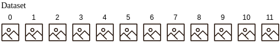
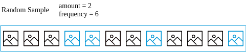
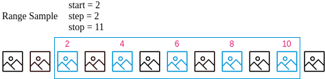

# ml-git: architecture and internals #

## metadata & data decoupling ##

The first design concept about ml-git is to decouple the ML entities metadata management from the actual data such that there are 2 main layers in the tool:
1. the metadata management : There are for each ML entities managed under ml-git, the user needs to define a small specification file. These files are then managed by a git repository to retrieve the different versions.

2. the data store management

|  |
|:--:|
| *Figure 1. Decoupling Metadata & Data Management Layers* |

### Content Addressable Storage for ml-git ##

ml-git has been implemented as a Content Addressable Storage, meaning that we can retrieve the information based on the content and not based on the location of the information.

|  |
|:--:|
| *Figure 2. self-describing content-addressed ID* |

Figure 2. shows the basic principle of multihash to obtain a CID which are used under the hood by ml-git to implement its content addressable storage layer.

In a nuthsell, CID, self-describing content-addressed ID enables natural evolution and customization over simple and fixed cryptographic hashing schemes.
As an argument why multihash is a useful feature, is that any cryptographic function ultimately ends being weak. As en example, when collisions have been proven with SHA-1, it's been a challenge for many softwares to use another cryptographic hash (including git).

Summarizing, a CID is :
* a unique identifier/hash of “multihash” content.
* encoding the digest of the original content enabling anyone to retrieve thatcontent wherever it lies (through some routing)
* enabling the integrity check of the retrieved content (thx to multihash and the encoded digest)

|  |
|:--:|
| *Figure 3. IPLD - CID for a file* |

There are a few steps to chunk a file to get an IPLD - CID format:
1. slide the file in piece of, say, 256KB
2. for each slice, compute its digest (currently, ml-git uses sha2-256)
3. obtain the CID for all these digests. These slice of files will be saved in a data store with the computed CID as their filename. 
4. build a json describing all the chunks of the file
5. obtain the CID of that json. That json will also be saved in the data store with the computed CID as its filename.

Note that this last CID is really the only piece of information you need to keep to retrieve the whole image.jpg file.
And last but not least, one can ensure the integrity of the file while downloading by computing the digests of all downloaded chunks and checking against the digest encoded in their CID.

Follow the links below for more information on
* [multihash](https://github.com/multiformats/multihash) 
* [CID](https://github.com/multiformats/cid)
* [IPLD](https://github.com/ipfs/js-ipfs/tree/master/examples/traverse-ipld-graphs)

### Why slicing files in chunks? ###

IPFS uses small chunk size of 256KB … Why?

* __security__ - easy to DOS nodes without forcing small chunks
* __deduplication__ - small chunks can dedup. big ones effectively dont.
* __latency__ - can externalize small pieces already (think a stream)
* __bandwidth__ - optimize the use of bandwidth across many peers
* __performance__ - better perf to hold small pieces in memory. hash along the dag to verify integrity of the whole thing.

the big DOS problem with huge leaves is that malicious nodes can serve bogus stuff for a long time before a node can detect the problem (imagine having to download 4GB before you can check whether any of it is valid). this was super harmful for bittorrent (when people started choosing huge piece sizes), attackers would routinely do this, very cheaply-- just serve bogus random data. smaller chunks are very important here.

## ml-git high-level architecture and metadata ##

|  |
|:--:|
| *Figure 4. ml-git high-level architecture and meta-/data relationships* |

So IPLD/CID has been implemented on top of the S3 driver.
The chunking strategy is a recommendation to turn S3 interactions more efficient when dealing with large files.
It's also interesting to note that if ml-git implements a Thread pool to concurrently upload & download files to a S3 bucket.
Last but not least, it would be possible to further accelerate ml-git interactions with a S3 bucket thanks to AWS CloudFront. (not implemented yet)

### ml-git baseline performance numbers ###

#### CamSeq01 under ml-git  ####

* CamSeq01 size : 92MB
* Locations: website in Cambridge -- S3 bucket in us-east-1 -- me in South Brazil

* Download from website: ~4min22s

* upload to S3 with ml-git : 6m49s
* download to S3 with ml-git : 1m11s

#### MSCoco (all files) under ml-git  ####

* MSCoco :
    * Size : 26GB
    * number of files : 164065 ; chunked into ~400-500K blobs (todo: exact blob count)
* Locations: original dataset: unknown -- S3 bucket in us-east-1 -- me in South Brazil

* Download from website: unknown

* upload to S3 with ml-git : 12h30m
* download to S3 with ml-git : 10h45m

#### MSCoco (zip files) under ml-git  ####

* MSCoco :
    * Size : 25GB
    * number of files : 3 (train.zip, test.zip, val.zip) ; 102299 blobs
* Locations: original dataset: unknown -- S3 bucket in us-east-1 -- me in South Brazil

* Download from website: unknown

* upload to S3 with ml-git : 4h35m
* download to S3 with ml-git : 3h39m

A couple of comments:
1) even though Python GIL is a challenge for true concurrency in the python interpreter, it still is very helpful and provides a significant improvement for ml-git performance,
2) not surprisingly, the number of files will affect the overall performance as it means there will be many more connections to AWS.
However, ml-git have an option to download some dataset partially (checkout with sampling) to enable CI/CD workflows for which some ML engineers may run some experiments locally on their own machine.
For that reason, it is interesting to avoid downloading the full dataset if it's very large. This option is not applicable if the data set was loaded as some zip files.

## ml-git add, commit, push commands internals ##

|  |
|:--:|
| *Figure 5. ml-git commands internals* |

# <a>Description ml-git commands internals</a>

### <a>Commands</a>:

<details>

<summary> <code>ml-git --help</code> </summary>
Display help information about ml-git commands. 
<br>
</details>

<details>
<summary> <code>ml-git --version</code> </summary>
Show version passed as parameter in click function.
<br>
</details>

<details>
<summary> <code>ml-git &lt;ml-entity&gt; add</code> </summary>

ml-git add search for metadata (.spec file) inside ml-git index corresponding to ml-entity-name (mandatory use):

```
ml-git_project/
└── .ml-git/
|   └── <ml-entity>/
|      └── index/
|         └── metadata/
|            └── <ml-entity-name>/ <-- Search .spec file
|               ├── <ml-entity-name>.spec
└── <ml-entity>/
```

 Then compares the tag of .spec file with the tag of git repository:

```
ml-git_project/
└── .ml-git/
|   └── <ml-entity>/
|      └── index/
|      |  └── metadata/
|      |     └── <ml-entity-name>/
|      |        ├── <ml-entity-name>.spec
|      └── metadata/ <- Check tag in git repository
└── <ml-entity>/
```

If the ml-git tag doesn't exist in git repository, ml-git create **INDEX.yaml** and **MANIFEST.yaml**:

```
ml-git_project/
└── .ml-git/
|   └── <ml-entity>/
|      └── index/
|      |  └── metadata/
|      |     └── <ml-entity-name>/
|      |        ├── <ml-entity-name>.spec
|      |        ├── INDEX.yaml <-- INDEX.yaml created.
|      |        ├── MANIFEST.yaml < -- Manifest created.
|      └── metadata/ <- Check tag in git repository
└── <ml-entity>/
```

The content of **MANIFEST.yaml** is a set of added multihash's files.

Then ml-git **caches** the file with hard links in cache path and add chunked files in **objects**:

```
ml-git_project/
└── .ml-git/
|   └── <ml-entity>/
|      └── index/
|      |  └── metadata/
|      |     └── <ml-entity-name>/
|      |        ├── <entity-name>.spec
|      |        ├── INDEX.yaml <-- INDEX.yaml created.
|      |        ├── MANIFEST.yaml < -- Manifest created
|      └── metadata/
|      └── cache/
|         └── hashfs/ <- Hard link of chunked files
|      └── objects/
|      |  └── hashfs/ <-- Chunk files
└── <ml-entity>/
```

**MANIFESTEST.yaml** structure example:

```
zdj7WWMZbq7cgw76BGeqoNUGFRkyw59p4Y6zD5eb8cyWL6MW5: !!set
  data/1.jpg: null
zdj7WWgUF7spcvxkBEN49gh44ZUMzbYMG9Mm5RPGU8bsXEDTu: !!set
  data/test.txt: null
zdj7WX8pZHGEAHXuzdJc2dwRXpyABuZznSx3BW867DA53Vksf: !!set
  data/8.jpg: null
zdj7WYF38pFqHrvQPnD3FXMw76UDbMaZkSXJ4qMZci1nxWqiU: !!set
  data/2.jpg: null
```

**INDEX.yaml** structure example:

```
data/1.jpg:
  ctime: 1582208519.35017 <-- Creation time.
  hash: zdj7WWMZbq7cgw76BGeqoNUGFRkyw59p4Y6zD5eb8cyWL6MW5
  mtime: 1582208519.3581703 <-- Modification time.
  status: a <-- Status file, (a, u, c)
data/test.txt:
  ctime: 1582208519.3521693
  hash: zdj7WWgUF7spcvxkBEN49gh44ZUMzbYMG9Mm5RPGU8bsXEDTu
  mtime: 1582208519.3561785
  status: a
data/8.jpg:
  ctime: 1582208519.3531702
  hash: zdj7WX8pZHGEAHXuzdJc2dwRXpyABuZznSx3BW867DA53Vksf
  mtime: 1582208519.4149985
  status: a
data/2.jpg:
  ctime: 1582208519.3551724
  hash: zdj7WYF38pFqHrvQPnD3FXMw76UDbMaZkSXJ4qMZci1nxWqiU
  mtime: 1582208519.5029979
  status: a
```

</details>

<details>
<summary> <code>ml-git &lt;ml-entity&gt; branch</code> </summary>

Search for **HEAD** file in:

```
ml-git_project/
└── .ml-git/
|   └── <ml-entity>/
|      └── index/
|      └── metadata/
|      └── cache/
|      └── refs/
|         └── <ml-entity-name>/
|            ├── HEAD <-- Search here.
└── <ml-entity>/
```

 Parse **HEAD** file as yaml and list the tags and their corresponding SHA-1.

**HEAD** structure example:

```
computer-vision__images__imagenet8__1: 00da0d518914cfaeb765633f68ade09a5d80b252
```


</details>

<details>
<summary> <code>ml-git &lt;ml-entity&gt; checkout</code> </summary>

```
ml-git (dataset|labels|model) checkout ML_ENTITY_TAG
```

Break up the ML_ENTITY_TAG into categories, specname and version, if the ML_ENTITY_TAG is the current tag, the command show the message *"Repository: already at tag [\<ml-entity-tag\>]"*, otherwise execute git checkout to the **ML_ENTITY_TAG**, then verify if cache has tag's objects:

```
ml-git_project/
└── .ml-git/
    └── <ml-entity>/
       └── cache/
          └── hashfs/ <-- Objects here
```

When objects not found in cache, the command download the blobs from data store to the workspace:

```
ml-git_project/
└── .ml-git/
|   └── <ml-entity>/
|      └── cache/
|         └── hashfs/
└── <ml-entity>/
   └── <categories>*/
      └── <ml-entity-name>/ < -- Workspace
```

When objects is found  in cache, the command update the objects hard link to the workspace:

```
ml-git_project/
└── .ml-git/
|   └── <ml-entity>/
|      └── cache/ <-- Check here
└── <ml-entity>/
   └── <categories>*/
      └── <ml-entity-name>/ <-- Update here
```

Then update the HEAD with **ML_ENTITY_TAG** and SHA-1, then execute git checkout to branch *master*.

#### <a name="mlgit_checkout_sample">ml-git \<ml-entity\> checkout \<ml-entity-tag\>  [--sample-type=\<sample\>] [--sampling] [--seed]</a>

This command has three types of sampling options available only for dataset: ```--sample-type=group --seed```,```--sample-type=random --seed```,```--sample-type=range``` .
We use [random.sample(population, k)](https://docs.python.org/3.7/library/random.html#random.sample) to return a sample of the size k from the population elements. We use [random.seed()](https://docs.python.org/3.7/library/random.html#random.sample) to set the seed so that the sample generated by `random.sample()` can be reproduced between experiments. We use the [range()](https://docs.python.org/3.7/library/stdtypes.html?highlight=range#range) object to take samples from a given range.


```Note:``` 
If you use this option ml-git will not allow you to make changes to the entity and create a new tag. 


#### Exemple:




Let's assume that we have a dataset that contains 12 files.

````ml-git dataset checkout computer-vision__images__dataset-ex__22 --sample-type=group --sampling=2:5 --seed=1```` : This command selects 2 files randomly from every group of five files to download.


````ml-git dataset checkout computer-vision__images__dataset-ex__22 --sample-type=random --sampling=2:6 --seed=1```` : This command makes a sample = (amount * len (dataset))% frequency ratio, sample = 4, so four files are selected randomly to download.  



````ml-git dataset checkout computer-vision__images__dataset-ex__22 --sample-type=range --sampling=2:11:2```` : This command selects the files at indexes generated by `range(start=2, stop=11, step=2)`.




</details>

<details>
<summary> <code>ml-git &lt;ml-entity&gt; commit </code></summary>

Firstly commit verifies ml-git tag existence, then updates status file in ``.ml-git/<ml-entity>/index/metadata/<ml-entity-name>/INDEX.yaml`` and merge the metadata ``.ml-git/<ml-entity>/index/metadata/<ml-entity-name>/MAFINEST.yaml`` with ``.ml-git/<ml-entity>/metadata/<ml-entity-name>/MAFINEST.yaml``.

Update **INDEX.yaml**:
```
data/1.jpg:
  ctime: 1582208519.35017
  hash: zdj7WWMZbq7cgw76BGeqoNUGFRkyw59p4Y6zD5eb8cyWL6MW5
  mtime: 1582208519.3581703
  status: a <- Change status 'a' to 'u'.
data/10.jpg:
  ctime: 1582208519.3561785
  hash: zdj7WZrTe7SU5oFQc8kr1kNiAkb5TBeMP1vgcXM1fvfgn5jq5
  mtime: 1582208519.6050372
  status: u
data/2.jpg:
  ctime: 1582208519.3551724
  hash: zdj7WYF38pFqHrvQPnD3FXMw76UDbMaZkSXJ4qMZci1nxWqiU
  mtime: 1582208519.5029979
  status: u
```

Merge the metadata ``.ml-git/<ml-entity>/index/metadata/<ml-entity-name>/MAFINEST.yaml`` with ``.ml-git/<ml-entity>/metadata/<ml-entity-name>/MAFINEST.yaml``:

```
ml-git_project/
└── .ml-git/
|   └── <ml-entity>/
|      └── index/
|      |  └── metadata/
|      |     └── <ml-entity-name>/
|      |        ├── MANIFEST.yaml < -- (1) Get data from here
|      └── metadata/
|         └── <categopries>*/
|            ├── MANIFEST.yaml < -- Union data (1) here, and delete (1).
└── <ml-entity>/
```

Get content of \<ml-entity-name\>.spec (structure with representational values):

```
dataset:
  categories:
    - computer-vision
    - images
  mutability: strict
  manifest:
    store: s3h://mlgit-datasets
  name: imagenet8
  version: 1
```

And insert new attribute:

```
dataset:
  categories:
  - computer-vision
  - images
  mutability: strict
  manifest:
    files: MANIFEST.yaml
    store: s3h://mlgit-datasets
  name: imagenet8
  version: 1
```

 Then save file in:

```
ml-git_project/
└── .ml-git/
|   └── <ml-entity>/
|      └── index/
|      |  └── metadata/
|      |     └── <ml-entity-name>/
|      |        ├── MANIFEST.yaml
|      |        ├── <ml-entity-name>.spec < -- Copy content and change
|      └── metadata/
|         └── <categopries>*/
|            ├── MANIFEST.yaml
|            ├── <ml-entity-name>.spec < -- Save here
└── <ml-entity>/
```

After committing the .spec file and MANIFEST.yaml, ml-git updates the HEAD of repository with tag's SHA-1.

HEAD structure:

```
computer-vision__images__imagenet8__1: 00da0d518914cfaeb765633f68ade09a5d80b252
```
HEAD directory:

```
ml-git_project/
└── .ml-git/
|   └── <ml-entity>/
|      └── index/
|      |  └── metadata/
|      |     └── <entity-name>/
|      |        ├── MANIFEST.yaml
|      |        ├── <entity-name>.spec < -- Copy content and change
|      └── refs/
|      |  └── <ml-entity-name>/
|      |      ├── HEAD  <-- Update tag with SHA-1 here.
|      └── metadata/
|         └── <categopries>*/
|            ├── MANIFEST.yaml
|            ├── <ml-entity-name>.spec < -- Save here
└── <ml-entity>/
```

***** *Categories path is a tree of categories paths described in .spec file. (Ex: categories/images/MANIFEST.yaml)*.

</details>

<details>
<summary> <code>ml-git &lt;ml-entity&gt; create </code></summary>

```
ml-git (dataset|labels|model) create ARTEFACT_NAME
```

Create the the workspace structure as follow:

```
ml-git_project/
└── .ml-git/
    └──config.yaml  
    <ml-entity>
    └── ARTEFACT_NAME/
        └── data/
        └── ARTEFACT_NAME.spec
        └── README.md
```

The parameters passed ```--category``` and ```--version-number``` are used to fill the spec file.
The parameter ```--import``` is used to import files from a src folder to data folder.
The optional parameter ```--wizard-questions``` if passed, ask interactive questions at console for git & store configurations and update the config.yaml file.
The parameter ```--store-type``` must be used to define the entity's storage, which can be: s3h, azureblobh, gdriveh.

The parameter ```--import-url``` is used to import files from Google Drive to data folder. 
Using this option it will be necessary to inform the path to your google drive credentials through the ```credentials-path``` argument. 
In addition, you can use the ```--unzip``` option to unzip the files imported.


</details>

<details>
<summary> <code>ml-git &lt;ml-entity&gt; export</code> </summary>

This command allows you to export files from one store (S3|MinIO) to another (S3|MinIO).

```
ml-git (dataset|labels|model) export ML_ENTITY_TAG BUCKET_NAME
```

Initially, it checks if the user is in an initialized ml-git project. With the ```entity tag```, ```--credentials```, ```--region```, ```--endpoint```, ```--retry``` and ```bucket name```  arguments, ml-git connects to the store (S3|MinIO) bucket. Then the files are exported to the target store (S3|MinIO) bucket.

</details>

<details>
<summary> <code>ml-git &lt;ml-entity&gt; fetch</code> </summary>

```
ml-git (dataset|labels|model) fetch ML_ENTITY_TAG
```

Break up the ML_ENTITY_TAG into categories, specname and version, then verify if cache has tag's objects, if not, download the blobs.

```
ml-git_project/
└── .ml-git/
    └── <ml-entity>/
       └── cache/
          └── hashfs/ <-- Objects here
```
</details>

<details>
<summary> <code>ml-git &lt;ml-entity&gt; fsck </code></summary>
<br>

Reads objects in:

```
ml-git_project/
└── .ml-git/
    └── <ml-entity>/
       └── index/
       |  └── hashfs/ <-- Objects here
       └── objects/
          └── hashfs/ <-- Objects here
```

Applies SHA2 to content of objects , uses multihash to generate the CID, and compares the CID with the file name, if it is different it mean that the file is corrupted, so ml-git fsck show the number of corrupted files and in which directory. When object is valid but not in originally directory, ml-git accept that it's corrupted.

</details>

<details>
<summary> <code>ml-git &lt;ml-entity&gt; gc</code> </summary>
<br>
```To Be Implemented```

</details>

<details>
<summary> <code>ml-git &lt;ml-entity&gt; import</code> </summary>
This command allows you to download a file or directory from the S3 bucket.

```
ml-git (dataset|labels|model) import BUCKET_NAME ENTITY_DIR
```

Initially checks if the user is in an initialized ml-git project. With the --credentials, --region (optional), --path and bucket name arguments ml-git connects to the S3 bucket. The S3 files for the file or directory specified in --path or --object will be downloaded. The files will be saved in the directory specified by the user in ENTITY_DIR, if not exists, the path will be created.

</details>

<details>
<summary> <code>ml-git &lt;ml-entity&gt; init</code> </summary>

When ml-git init is executed, it will read **.ml-git/config.yaml** to get the git repository url. ml-git will create directory .ml-git/**\<ml-entity\>/metadata** if doesn't exists and **clone** the repository into it.

```
ml-git_project/
└── .ml-git/
    └── <ml-entity>/
        └── metadata/ <-- The example command clone git repository here.
```

*Obs: Must have executed ml-git init before, to create ml-git initial configuration files.*


</details>

<details>
<summary> <code>ml-git &lt;ml-entity&gt; list </code></summary>

That command will list all \<ml-entity\> under management in the ml-git repository. To do this, ml-git goes through the metadata directory to identify the structure of categories and entities that are under management.

```
ml-git_project/
└── .ml-git/
|   └── <ml-entity>/
|      └── metadata/ <-- Check here the directory structure
|         └── computer-vision/
|            └── images/
|               └── imagenet8/
```


```
$ ml-git dataset list
ML dataset
|-- computer-vision
|   |-- images
|   |   |-- imagenet8
```


</details>

<details>
<summary> <code>ml-git &lt;ml-entity&gt; push</code> </summary>

```
ml-git (dataset|labels|model) push ML_ENTITY_NAME
```

Verify the git global configuration, and try upload **objects** from local repository to data store creating a thread pool with maximum of ten workers. This process use store configuration from spec file and AWS credentials.

.spec file:

```
dataset:
  categories:
    - computer-vision
    - images
  manifest:
    store: s3h://mlgit-datasets < -- store configuration
  name: imagenet8
  version: 1
```

Directory:

```
ml-git_project/
└── .ml-git/
|   └── <ml-entity>/
|      └── index/
|      └── metadata/
|      └── objects/ < -- Files to be uploaded.
└── <ml-entity>/
    └── <ml-entity-name>/
       ├── <ml-entity-name>.spec < -- Spec file with store configuration.
```

After the upload process, ml-git executes **git push** from local repository **.ml-git/dataset/metadata** to the remote repository configured in **config.yaml**.

</details>

<details>
<summary> <code>ml-git &lt;ml-entity&gt; remote-fsck </code></summary>

Starting point of a remote fsck is to identify all the IPLD files contained in the MANIFEST file associated with the specified artefact spec (\<ml-artefact-name\>) and then executes the following steps:

* Verify the existence of all these IPLDs in the remote store
    * If one IPLD does not exist and it is present in the local repository, upload it to the remote store
* If the IPLD is present in the local repository:
    * Open it and identify all blobs associated with that IPLD.
    * Verify the existence of these blobs in the remote store.
    * If one blob does not exist and it is present in the local repository, upload it to the remote store.
* If the IPLD is NOT present in the local repository and --thorough option is set
    * Download the IPLD
    * Open it and identify all blobs associated with that IPLD.
    * Verify the existence of these blobs in the remote store.
    * If one blob does not exist and it is present in the local repository, upload it to the remote store.

``[--paranoid]``: 
Paranoid mode adds an additional step that will download all IPLD and its associated IPLD links to verify the content by computing the multihash of all these.<br />
<br />
``[--thorough] ``:
Ml-git will try to download the IPLD if it is not present in the local repository to verify the existence of all contained IPLD links associated.


</details>

<details>
<summary> <code>ml-git &lt;ml-entity&gt; reset </code></summary>

In ml-git project (as in git) we have three areas to manage and track the changes of the data.<br />
The workspace - where the data itself is added, deleted or updated.
```
ml-git_project/
└── .ml-git/
└── <ml-entity>/
    └──<ml-entity-name>
        └──HERE

```
That staged area  - Where the changes are added and tracked.
```
ml-git_project/
└── .ml-git/
    └── <ml-entity>/
       └── index/
           └──HERE
       └── metadata/ 
```
The committed area - Where the data are packed to push.
```
ml-git_project/
└── .ml-git/
    └── <ml-entity>/
       └── index/
       └── metadata/
           └──HERE 
```

Depending how to commands are passed we manage this three areas accordingly.<br />
The Default option is HEAD.
</details>

<details>
<summary> <code>ml-git &lt;ml-entity&gt; show</code> </summary>

Verify **tag** and **SHA-1** in HEAD:

```
ml-git_project/
└── .ml-git/
    └── <ml-entity>/
       └── index/
       └── metadata/
       └── objects/
       └── refs/
          └── <ml-entity-name>/
             ├── HEAD < -- Verify tag
```

If tag was not found, the command return the message *"Local Repository: no HEAD for [\<ml-entity-name\>]"*, otherwise do git checkout to the **tag** and search for all **\<ml-entity-name\>.spec** file in: 

```
ml-git_project/
└── .ml-git/
    └── <ml-entity>/
       └── index/
       └── metadata/
       |  └── <categories>*/
       |     └── <ml-entity-name>/ <-- Search all .spec file here
       └── objects/
       └── refs/
```

After found all .spec files the command show each one contents, then execute git checkout to branch *master*.

***** *Categories path is a tree of categories paths described in .spec file.*

</details>

<details>
<summary> <code>ml-git &lt;ml-entity&gt; status </code></summary>

Displays paths that have differences between the index file and the current
HEAD commit, paths that have differences between the working tree and the index
file, and paths in the working tree that are not tracked by ml-git.

First is described the files **tracked** to be commited.
Those files are those ones in the manifest file.
There are two types: 
* New files - Those files are at the entities directory and hard-linked with those ones at index directory.
These files are also listed in manifest file.
* Deleted file. - Files who was deleted from the entities directory, but still are into the manifest file.

```
ml-git_project/
└── <ml-entity>/
    └── <ml-entity-name>/
       ├── <-- Files Checked
```

```
ml-git_project/
└── .ml-git/
    └── <ml-entity>/
       └── index/
       |  └── <metadata>/
       |     └── <ml-entity-name> <-- Hard link poited to files located here
       |         └── MANIFEST.yaml <-- Files listed here
```

Then are described the **untracked** files.
These files are located under the entities directory and listed if they have more than one hard-link.

</details>

<details>
<summary> <code>ml-git &lt;ml-entity&gt; tag add</code></summary>

```
ml-git (dataset|model|label) tag add dataset-ex my_tag
```

You can use this command to associate a tag to a commit.

</details>

<details>
<summary> <code>ml-git &lt;ml-entity&gt; tag list </code></summary>

This command lists the tags of an entity. To do this, it access the metadata of an entity to get the git repository and then executes git commands to list local tags.

```
ml-git_project/
└── .ml-git/
    └── <ml-entity>/
       └── index/
       └── metadata/
          └── .git/  < -- Git repository
       └── objects/
       └── refs/
```

</details>

<details>
<summary> <code>ml-git &lt;ml-entity&gt; update </code></summary>
Locate metadata directory where is git repository:

```
ml-git_project/
└── .ml-git/
    └── <ml-entity>/
       └── metadata/
          └── .git < -- Git repository goes here.
```

Then ml-git execute  "git pull" on "origin" to update all metadatas from remote repository.

</details>

<details>
<summary> <code>ml-git &lt;ml-entity&gt; unlock </code></summary>
<br>

This command add read and write permissions to file or directory. 
So that if you are working with a flexible mutability repository you will be allowed to make changes to the unlocked file without making it corrupt.
If you are working with a strict repository, changing files is not allowed, so the unlock command is not performed. In the case of a mutable repository, the files are already unlocked for modification, so it is unnecessary to execute the unlock command.
You should only use this command for the flexible mutability option.

</details>

<details>
<summary> <code>ml-git clone &lt;repository-url&gt;</code> </summary>

The command clones the git repository which should contain a directory **.ml-git**, then initialize the metadata according to configurations. ml-git will create directory .ml-git/**[\<ml-entity\>](#ml_enitity)/metadata** if doesn't exists and **clone** the repository into it.

```
ml-git_project/
└── .ml-git/
    └── <ml-entity>/
        └── metadata/
```

**Options**:

`--folder`:
The configuration files are cloned in specified folder.

`--track`:
The ml-git clone preserves **.git** folder in the same directory of cloned configuration files.

```
ml-git_project/
└── .ml-git/
    └── <ml-entity>/
       └── metadata/
          └── .git
```

</details>

<details>
<summary> <code>ml-git login</code> </summary>

This command generates new Aws credentials in the __/.aws__ directory. 

Note: 

</details>

<details>
<summary> <code>ml-git repository config </code></summary>
Command try to load the configurations from the file **.ml-git/config.yaml**. 

If the file is found, it will show the configurations read from the file, if not it will show the default configurations in the project.
</details>

<details>
<summary> <code>ml-git repository init</code> </summary>

ml-git repository init verify if the current directory has **.ml-git**, where configuration files goes, and if doesn't have it, ml-git will create the directory and save **config.yaml** inside, with the informations provided by a *dict* in project code. 

**Directory structure**:
```
ml-git-project/
└── .ml-git/
    ├─── config.yaml
```

**config.yaml structure**:
```
dataset:
  git: git@github.com:standel/ml-datasets.git <-- git project url
store:
  s3: <-- store type (AWS)
    mlgit-datasets: <-- bucket name
      aws-credentials:
        profile: mlgit
      region: us-east-1
```
</details>

<details>
<summary> <code>ml-git repository remote &lt;ml-entity&gt; add </code></summary>

This command load the configuration file **.ml-git/config.yaml** and change the attribute **git** to the **url** specified on arguments, then save it. This command require that you have executed ```ml-git init``` before.

</details>

<details>
<summary> <code>ml-git repository remote &lt;ml-entity&gt; del</code> </summary>

This command load the configuration file **.ml-git/config.yaml** and change the attribute **git** to empty, the save it.

```
ml-git_project/
└── .ml-git/
    └── <ml-entity>/
       └── metadata/ <- Delete this directory.
          └── .git
```

</details>

<details>
<summary> <code>ml-git repository store add </code></summary>

ml-git store verify option [`[--type=<store-type>]`](#store-type),  then open existent file **.ml-git/config.yaml** and append the new storage.

You can use three types of storage (S3, MinIO, Azure or GDrive). See how configure each type in [Storage Configuration](storage_configurations.md) file.

</details>

<details>

<summary> <code>ml-git repository store del </code></summary>


ml-git open existent file **.ml-git/config.yaml**:

**config.yaml structure**:
```
dataset:
  git: git@github.com:standel/ml-datasets.git <-- git project url
store:
  s3: <-- store type (AWS)
    mlgit-datasets: <-- bucket name
      aws-credentials:
        profile: mlgit
      region: us-east-1
```
Then verify if the store exists in the file. Remove if exists.
</details>